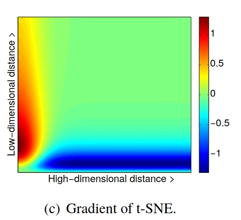
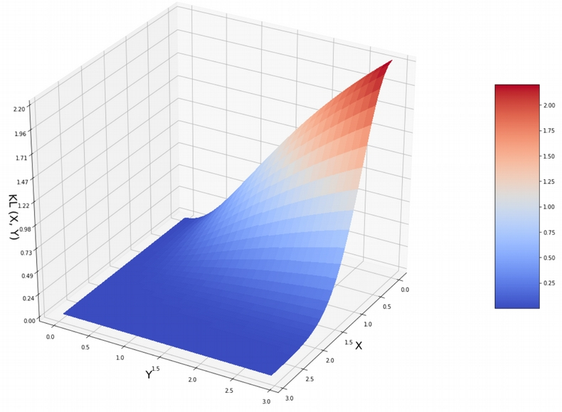
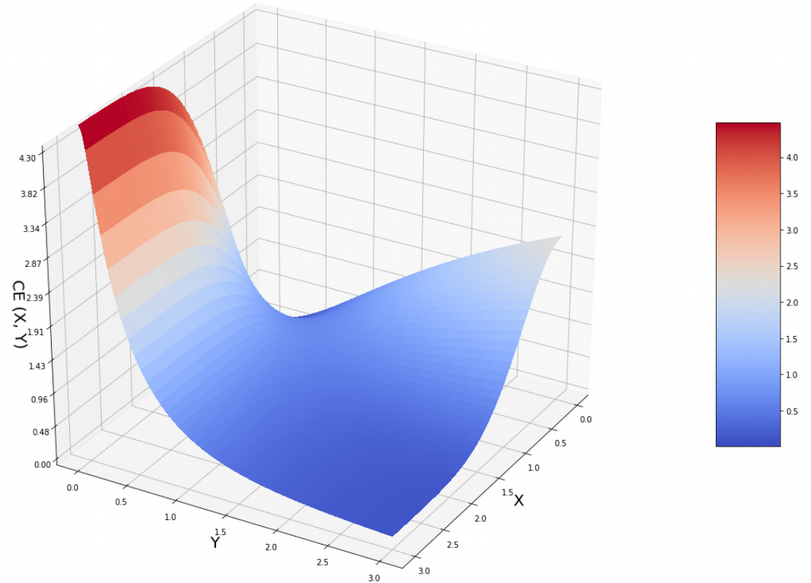
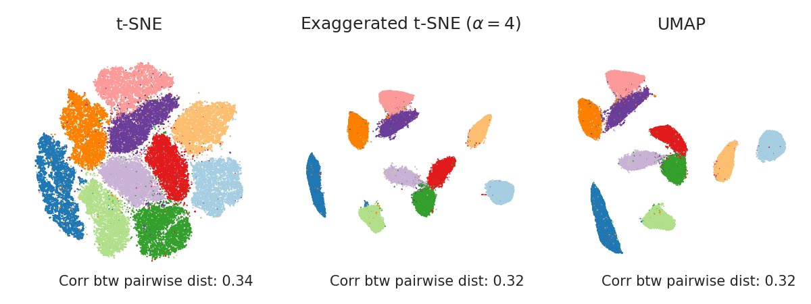

An interesting [paper](https://t.co/HqrAO4343l?amp=1) / [twitter](https://twitter.com/hippopedoid/status/1227731661946834944) discussion about UMAP vs tSNE.
 

If I understand correct, roughly speaking;

### tSNE
tSNE calculates a similarity score for each point compared to **ALL** points. 
Attraction and repulsion are always relative to how similar/disimilar points are. 
However in tSNE we set a perplexity parameter which kinda means (but also very much doesn't) how many neighbours are attracted, with the rest being repulsed. 
The problem with the "cost function" of tSNE (Kullback-Leibler divergence) is that it primarily focuses on that points that are close in high dimensional space are close in low dimensional space, and vice versa.

In this image the x-axis represents the "dissimilarity" between points. (note the assymetric shape)

Another representation of this cost function (but then as gradient) in 2D from the tSNE paper:

(again assymetric, but not as bad as the previous image)

There is [quite some discussion](https://towardsdatascience.com/why-umap-is-superior-over-tsne-faa039c28e99) about this cost function and why it is bad/good. 
In this blogpost the author shows us this figure, and argues about why the cost function is bad. 
Where X is the distance in high dimension, and Y the distance in low dimension, and Z the KL divergence cost.

How come the gradient starts high in (0.0; 0.0) and only decreases from there? 
That's because (I think) the X and Y axes are not drawn far enough to show the increase again.

### UMAP
UMAP works by taking N nearest neighbours in high-dimensional space. And calculating the cross-entropy loss instead of the KL divergence:

Here we see that the cross-entropy also is very unhappy about points that are close in high-dimensional space (X) and and far in low-dimensional space (Y), just like the KL divergence.
However the cross entropy loss is more easily unhappy with points that are far in high-dimensional space, but close in low-dimensional space.

The N nearest neighbours are attracted relatively strong (with closer neighbours stronger than farther neighbours). 
But the rest of the points are repulsed with equal strength. 
Repulsion then becomes "non-specific", in the sense that it doesn't matter how different points are, they are all repulsed with the same strength. 

### tweet / paper
The problem about UMAP and its cost function is that since we only calculate forces for the N nearest neighbours, and the rest of the forces are constant. 
We expect the N nearest neighbours to be within the (fictional) space of X <= 1.5 >= Y of the previous image. 
In this space the KL divergence and the cross-entropy are extremely similar in shape!
This means that tSNE and UMAP optimize the same thing! 

So what is the difference between UMAP and tSNE? The authors of the paper & tweet show two important differences. 

- Initialization: 
UMAP is initialized "smart", and tSNE "dumb" (random). 
This means that UMAP has an easier job since its starts with a better guess. 
When tSNE is started smartly the differences between the two almost disappear. 
- Cost of dissimilarity: 
In UMAP all dissimilar points push each other away only very softly.
This makes it that attraction is relatively strong, and makes tight small clusters, 
and large distances between clusters.
When you decrease the repulsion forces in tSNE 4 fold, you actually get extremely similar results as in UMAP!!!!

And honestly, that the methods are doing almost is the same is not that big of a surprise... 
The last section of the paper of UMAP is a comparison in how similar the two methods are
 https://arxiv.org/pdf/1802.03426.pdf (page 48)z
